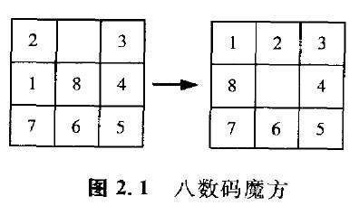

### 2.3.1 启发式搜索

以前谈到的算法，**只利用标有图的形状和代价的状态空间图**直接表示出来的信息。因而在状态空间变大时，与之相应的**搜索所需的时间和存储量**都会相应地**增大**。在人工智能处理的问题中，同样存在着状态空间非常大的问题。

例如在图2. 1中表示的8数码魔方中，存在有**9!/2**=181440种不同的状态。

在15数码魔方中，这个数目会变得更大，这时它可以达到**16!/2**种不同的状态，如果采用一个不漏地进行试验的搜索方法获得求解结果，将会是一件很困难的事情。

因此，尽可能地减小搜索范围的方法变得越来越重要。为此，出现了**应用启发式(应用已有知识)的方法**，这种搜索方法被称为启发式搜索。例如在迷宫问题中，如果知道目标状态的位置，那么就应该**考虑采取尽可能靠近该位置的搜索策略**。针对该问题的一种方法，是当设定目标节点的坐标为(Xg,Yg)时，利用从节点n=(x,y)到目标节点的曼哈顿距离h(n)=(Xg-x)+(Yg-y)的绝对值，对能使这个距离值变小的那种节点进行扩展。

**不过，这种启发式的方法，虽然在多数情况下是有用的，但是未必都是正确的。**例如在图2. 9所示的那种迷宫中，

对节点G进行扩展时，存在着两个可以进行扩展的候选节点，即E=(1,1)和H=(3,0)。这时，h(E)=(3-1)+(3-1)=4,h(H)=(3-3)+(3-0)=3,**虽然可以说H一方离目标节点近，但这却不是正确的选择。**

---
** 整理:[mindcont](https://github.com/mindcont)-原著 《人工智能》 [日]沟口理一郎 石田 亨编 **

2016-06-04 第一次编辑