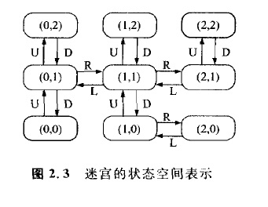

### 2.2.2 closed 表的引入

为避免发生上述情况，可以采取一些措施，使得同一个节点不会被两次扩展。为此，可以把扩展过一次的节点，记录到CLOSED表中，从而使其不再成为以后扩展时的候选对象。于是新的算法就变成一了下列形式。    

**算法2**   CLOSED表的引人    

    第1步:设初始节点为n;    
    第2步:如果节点n为目标节点，则求解以成功告终;    
    第3步:扩展节点n，得到子节点的集合。将n加进CLOSED表中;    
    第4步:从子节点的集合中选择一个未包含在CLOSED表中的节点，并设其为n。
          如果不存在这样的节点，则求解以失败告终;    
    第5步:设n为新的n并进人第2步。    

在算法2中，同一状态不可能两次扩展，于是可以导出下列命题。

 **命题2. 1** 如果搜索图是有限的，则算法2必定会停止。    
 **<证明>**如果搜索图是有限的，则节点数也是有限的。因为算法的扩展数不超过节点数，所以会停止下来。
 
 
 
根据命题2. 1，在有限搜索图的情况下，虽然停止性可以得到保证，但是却有可能发生得不到解的问题。例如在图2. 3中，设按照节点(0,0),(0,1),(0,2)的顺序进行扩展。这时作为(0,2)的子状态，虽然能够得到状态(0,1)，但是因为这个状态已经包含在CLOSED表内，所以在第4步中会以失败而告终。即走到了尽头而不能退出，这是这种算法的缺点。

---
** 整理:[mindcont](https://github.com/mindcont)-原著 《人工智能》 [日]沟口理一郎 石田 亨编 **

2016-04-18 第一次编辑