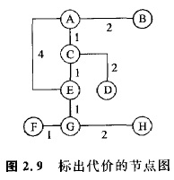
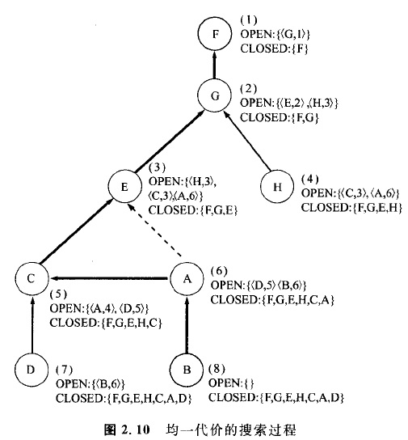

### 2.2.6 均一代价搜索

从此开始，我们来处理必须考虑解的代价的问题。例如在迷宫问题中，会遇到希望以尽可能短的距离到达出口的情况。解的代价是以导出解的算符的代价之和来表示的，这种算符的代价，可以用图2. 9中表示的分枝的代价表示。用C(n;,n;)表示从节点Ni到Nj的分枝的代价。另外，设分枝的代价为正值。例如，从F到G的分枝代价为1，且用C(F,G)=1表示。因此，当设初始节点为F，目标节点为B时，F-G-E-C-A-B就是一个解，它的代价为1+1+1+1+2=6。另外，F-G-E-A-B也是一个解，它的代价为1+1+4+2=8。如果不存在比某个解s的代价更小的解，则s就被称为**最优解**。在这个例子中，F-G.-E-C-A-B就成了最优解。

这里让我们来说明求最优解的**均一代价搜索算法**。搜索的方针是起始于初始节点，并从路径代价更小的节点进行扩展。现在我们用g‘(n)表示从节点N的初始节点开始的最优路径。另外，在搜索过程中采用的估计值用g(n)表示。此外，设将节点及其(估计)代价记录到OPEN表中，并且按照代价的递增次序进行排序。

**算法4**  均一代价搜索

    第1步:将初始节点Ni及其代价g（Ni）放人OPEN表中;    
    第2步:把OPEN表中最前面的节点取出来，并且设为n。
          如果OPEN表是空的，则求解以失败告终。
          如果节点n是目标节点，则求解以成功告终;    
    第3步:扩展节点二，得到子节点的集合。将n放入CLOSED表;    
    第4步:对于子节点的集合中不包含在closed表中的节点n'，配置指向n的指针。
    计算g(n')=g(n)+c(n,n')，并且将其放入OPEN表。
    但是n'已经放人OPEN表，当新的g(n')比估的值小时，则应予以更新，指针也应予以更换。
    对于OPEN表应依照代价的递增次序进行分类;    
    第5步:返回到第2步。

根据上述算法，可以将图2. 9中表示的节点图的搜索情况表示成图2.l0。 OPEN表的元素是用节点名及其代价对来表示的。在对节点E进行扩展时，节点A被放人OPEN表，对C进行扩展时g(A)的值和指针的更换，都是需要注意的事项。图2.10中，归的指针用虚线表示。

在均一代价搜索的情况下，第4步中放入closed表中的节点，没有必要再放人OPEN表中。这可以从下面的定理导出。

**定理2. 2** 均一代价搜索对节点n进行扩展时，通往节点n的最优路径便已经被找到。即g(n) =g'(n)。

**<证明>**如能证明OPEN表中最前面节点的g(n)为非衰减函数，则定理即得到证明。

在均一代价搜索的情况下，由第2步到第5步的循环过程中，OPEN表中最前面的节点N将被除去，而其子节点的集合将被加进来，所以根据需要，OPEN表内节点的代价会产生变化。对于节点N的子节点n’，等式g(n')=g(n)+c(n,n')成立，因为c(n,n')>0，所以g(n')>g(n)。于是在OPEN表中被添加的节点，或者说代价发生了变化的节点的代价，其总和是非衰减的。因此，将来不可能找到比OPEN表中最前面的节点n的代价g(n)更小的代价.所以g(n)是最小代价。

另外，即使是对于**无限图**，因为也能够保证算法会**终止**(证明略)，所以只要**均一代价搜索存在最优解**，则必定找到这个解的所谓**可纳性**会得到保证。这里如果假定图中分枝的代价全为1，则这种算法与**横向搜索**是一致的。
    

---
** 整理:[mindcont](https://github.com/mindcont)-原著 《人工智能》 [日]沟口理一郎 石田 亨编 **

2016-05-04 第一次编辑